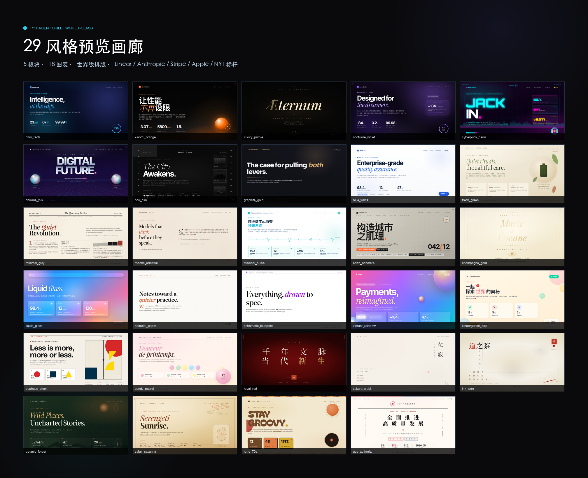
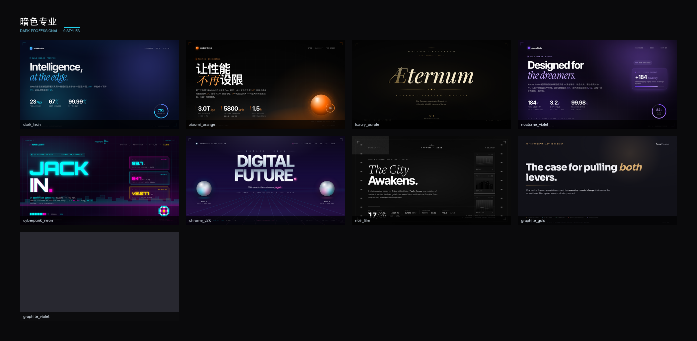
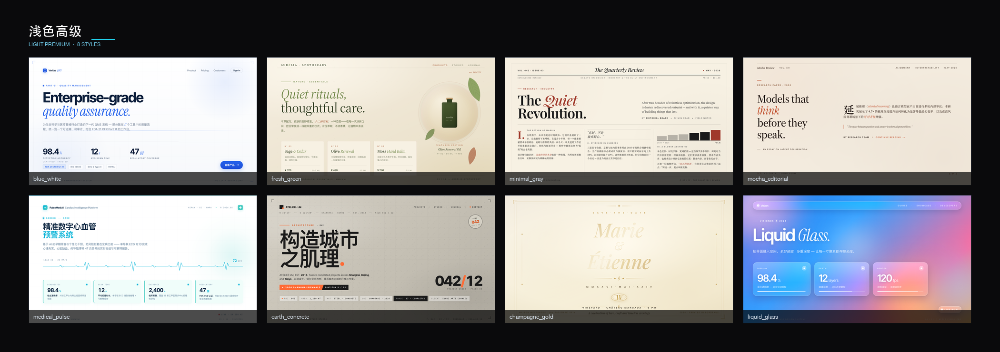
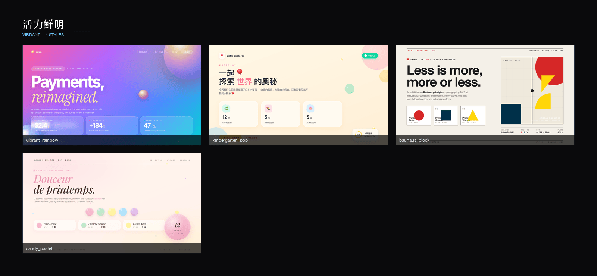
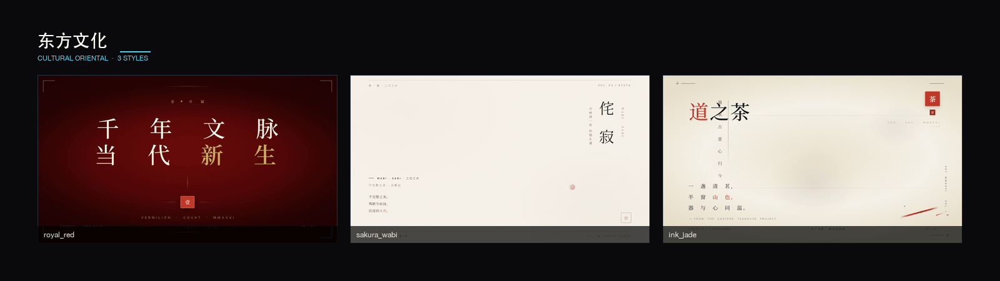
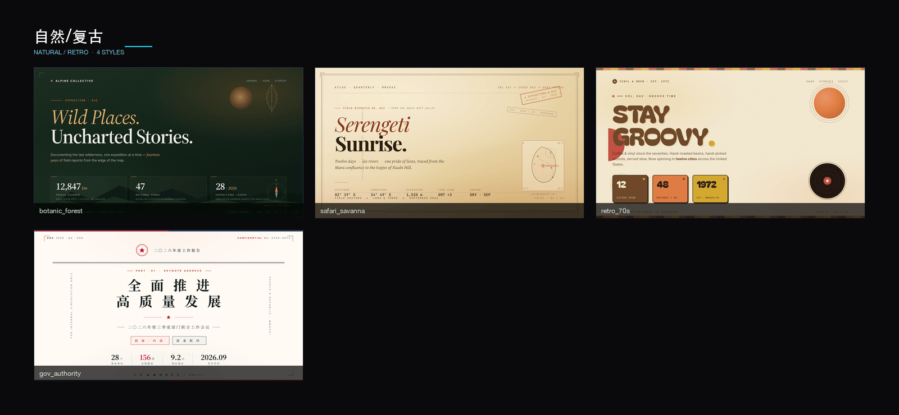
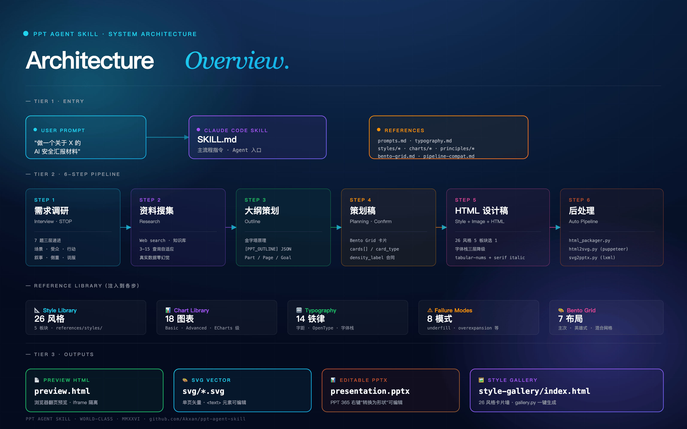

<div align="center">
  

  <h1>PPT Agent Skill</h1>

  <p><strong>World-class AI presentation generator</strong> · One sentence in, design-agency-quality deck out</p>

  <p>
    <a href="README.md">中文文档</a> ·
    <a href="#-quick-start">Quick Start</a> ·
    <a href="#-style-gallery-28-styles">Gallery</a> ·
    <a href="#-workflow">Workflow</a> ·
    <a href="#-architecture">Architecture</a>
  </p>

  <p>
    
    
    
    
  </p>

  <p>
    <a href="https://github.com/Akxan/ppt-agent-skill/stargazers"></a>
    <a href="https://github.com/Akxan/ppt-agent-skill/network/members"></a>
    <a href="https://github.com/Akxan/ppt-agent-skill/watchers"></a>
    <a href="https://github.com/Akxan/ppt-agent-skill/issues"></a>
  </p>

  <p>
    <a href="LICENSE"></a>
    
    
    
    
    
    
    
  </p>

  <p>
    <strong>Benchmarked against</strong>
    <code>Linear</code> · <code>Anthropic</code> · <code>Stripe</code> · <code>Apple</code> · <code>NYT Magazine</code> · <code>Tom Ford</code> · <code>Pitch</code> · <code>Mercury</code> · <code>Vercel</code>
  </p>
</div>

---

<div align="center">
  
  <p><sub>28 world-class styles across 5 categories · Real 1280×720 reference mocks</sub></p>
</div>

---

## 💡 What is this?

A **Claude Code Skill** that simulates the complete workflow of a $1,000+/page PPT design agency, turning a single sentence into a professional deck (HTML + editable vector PPTX).

Not "outline-into-template" — a full pipeline of **research-first generation / content-driven layouts / global style consistency / real-data filling**.

Each style mirrors the actual production typography of world-class brands (**not from screenshots — from reading their live CSS**): letter-spacing rules, tabular-nums, OpenType features, sans + serif italic mixing, three-tier font fallback chains.

## 🎨 Key Features

| Feature | Description |
|---------|-------------|
| **6-Step Pipeline** | Interview → Research → Outline → Planning → HTML Design → Post-process (SVG + PPTX) |
| **28 World-Class Styles** | 5 categories: Dark Professional 7 / Light Premium 10 / Vibrant 4 / Cultural Oriental 3 / Natural Retro 4 |
| **18 Data Visualizations** | 8 basic + 6 advanced (radar/timeline/funnel/gauge) + 4 ECharts-grade (world map/network/Sankey/heatmap calendar) |
| **Bento Grid Layouts** | 7 flexible card layouts driven by content, not templates |
| **World-Class Typography** | 7-level scale · letter-spacing rules · tabular-nums · OpenType features · serif italic mixing · 3-tier font fallback |
| **Smart Illustrations** | AI-generated images with 5 visual fusion techniques (fade/tinted overlay/ambient bg/etc.) |
| **Failure Modes Catalog** | 8 failure modes (underfill / decorative_substitution / etc.) + repair-order rules |
| **Cross-page Narrative** | Density alternation · chapter color progression · cover-ending visual echo |
| **Style Preview Gallery** | `gallery.py` one-shot generates a 28-style card-wall index |
| **Smoke Testing** | `smoke_test.py` validates JSON / pipeline-compat / typography / e2e pipeline |
| **PPTX Compatible** | HTML → SVG → PPTX pipeline; right-click "Convert to Shape" in PPT 365 for full editing |

## 🚀 Quick Start

**Use as a Claude Code Skill** (recommended):

```
You: Make a presentation about X
  ↓
Agent asks 7 interview questions (waits for your answers)
  ↓
Auto-research → outline → planning draft → per-page HTML design
  ↓
Auto post-processing: HTML → SVG → PPTX
  ↓
All artifacts saved to ppt-output/<deck-name>/ (one folder per deck)
```

**Trigger examples**:

| Scenario | What to say |
|----------|-------------|
| Topic only | `Make a PPT about X` / `Create a presentation on Y` |
| With source | `Turn this document into slides` / `Make a deck from this report` |
| With requirements | `15-page dark-tech style AI safety presentation` |
| Implicit | `I need to present to my boss about Y` / `Make training materials` |

**Requirements**:

```bash
# Python deps
pip install python-pptx lxml Pillow

# Node.js >= 18; puppeteer auto-installs on first html2svg.py run
```

## 🎨 Style Gallery (28 styles)

Five categories cover all typical commercial scenarios. Every mock is a real 1280×720 design:

### Dark Professional (7 styles · `references/styles/dark.md`)

<div align="center">
  
</div>

> Linear / Apple Hardware / Tom Ford / Cyberpunk 2077 / Y2K / Magnum etc.

| ID | Inspiration | Best for |
|----|-------------|----------|
| `dark_tech` | Linear.app | AI / SaaS / Developer tools |
| `xiaomi_orange` | Apple Keynote (hardware) | Hardware / IoT / Auto launches |
| `luxury_purple` | Tom Ford | Luxury / High-end branding |
| `nocturne_violet` | Linear (purple variant) | Designer SaaS / Startup launches |
| `cyberpunk_neon` | Cyberpunk 2077 | Gaming / Esports / Web3 |
| `chrome_y2k` | Y2K / Vaporwave | Web3 / Millennial retro |
| `noir_film` | Magnum / B&W documentary | Documentary / Photography / Editorial |

### Light Premium (8 styles · `references/styles/light.md`)

<div align="center">
  
</div>

> Apple / Anthropic / NYT Magazine / iOS 26 / Mayo Clinic / Suisse Int'l / Wedding invitations

| ID | Inspiration | Best for |
|----|-------------|----------|
| `blue_white` | Apple enterprise pages | Enterprise SaaS / Training / Healthcare-finance |
| `fresh_green` | Aesop | Skincare / Wellness / Food / Beauty |
| `minimal_gray` | NYT Magazine | Academic / Legal / Consulting / Whitepapers |
| `mocha_editorial` | Anthropic / Pantone 2025 | AI safety research / Publishing |
| `medical_pulse` | Mayo Clinic | Medical / Pharma / Insurance |
| `earth_concrete` | Suisse Int'l | Architecture / Industrial / Coffee branding |
| `champagne_gold` | Wedding invitations | Weddings / Galas / Award ceremonies |
| `liquid_glass` | iOS 26 / visionOS | XR / AR / Apple ecosystem launches |

### Vibrant (4 styles · `references/styles/vibrant.md`)

<div align="center">
  
</div>

| ID | Inspiration | Best for |
|----|-------------|----------|
| `vibrant_rainbow` | Stripe Sessions | Marketing / Creators / Conferences |
| `kindergarten_pop` | High-quality children's books | Children's education / Kids learning |
| `bauhaus_block` | Bauhaus / Swiss Design | Education / Creative brands / Indie design |
| `candy_pastel` | Ladurée patisserie | Sweets / Bakery / Snacks |

### Cultural Oriental (3 styles · `references/styles/cultural.md`)

<div align="center">
  
</div>

| ID | Inspiration | Best for |
|----|-------------|----------|
| `royal_red` | Beijing 2022 Opening Ceremony | Chinese cultural / Governmental / Heritage |
| `sakura_wabi` | Japanese wabi-sabi | Japanese brands / Tea ceremony / Ryokan |
| `ink_jade` | New Chinese guochao | Tea drinks / Heritage cultural / Indie bookstores |

### Natural / Retro (4 styles · `references/styles/natural.md`)

<div align="center">
  
</div>

| ID | Inspiration | Best for |
|----|-------------|----------|
| `botanic_forest` | Patagonia / Nat Geo | Outdoor / Sustainability / Forestry |
| `safari_savanna` | National Geographic | Travel / Adventure / Documentary |
| `retro_70s` | Wes Anderson / 70s posters | Indie cafes / Vinyl / Retro brands |
| `gov_authority` | People's Daily / State banquets | Governmental / Major conferences |

## 📈 18 Data Visualizations

| Tier | Count | Charts | File |
|------|-------|--------|------|
| **Basic** | 8 | Progress bar · Compare bar · Ring chart · Sparkline · Waffle · KPI card · Metric row · Rating | [`charts/basic.md`](references/charts/basic.md) |
| **Advanced** | 6 | Radar · Timeline · Funnel · Gauge · Grouped bar · Simple map | [`charts/advanced.md`](references/charts/advanced.md) |
| **ECharts-grade** | 4 | World choropleth · Network graph · Sankey · Heatmap calendar | [`charts/complex.md`](references/charts/complex.md) |

All implemented in pure HTML/CSS/SVG, **no JS runtime** (preserves svg2pptx pipeline). All charts auto-adapt to the 28 styles via CSS variables.

## 🔧 Workflow

```
┌────────────┐  ┌────────────┐  ┌────────────┐  ┌────────────┐  ┌────────────┐  ┌────────────┐
│  Step 1    │  │  Step 2    │  │  Step 3    │  │  Step 4    │  │  Step 5    │  │  Step 6    │
│  Interview │→ │  Research  │→ │  Outline   │→ │  Planning  │→ │  Style+    │→ │  Post-     │
│            │  │            │  │            │  │            │  │  Design    │  │  process   │
│  7-Q deep  │  │  3-15 srch │  │  Pyramid + │  │  Bento     │  │  28 styles │  │  HTML→SVG  │
│  interview │  │  adaptive  │  │  self-test │  │  cards     │  │  + images  │  │  →PPTX     │
└────────────┘  └────────────┘  └────────────┘  └────────────┘  └────────────┘  └────────────┘
   STOP wait                                       Wait confirm    Batch by part      Auto exec
```

Detailed flow in [`SKILL.md`](SKILL.md).

## 🏗 System Architecture

<div align="center">
  
  <p><sub>3-tier architecture: User Entry / 6-Step Pipeline / Output Artifacts · 5 Reference Libraries injected at each step</sub></p>
</div>

**3 tiers**:

- **TIER 1 · Entry** — User prompt triggers [SKILL.md](SKILL.md) (Agent entry); pulls from all `references/` rule files
- **TIER 2 · 6-Step Pipeline** — Each step is independent, JSON contracts between steps; each step shows which references it uses
- **TIER 3 · Outputs** — 4 final artifacts: paginated HTML / vector SVG / editable PPTX / style preview gallery

**Reference Library** (injected at each step):

| Module | Count | Location |
|--------|-------|----------|
| 📐 Style Library | 28 styles | `references/styles/` (5 categories) |
| 📊 Chart Library | 18 charts | `references/charts/` (3 tiers) |
| 🔤 Typography | 14 rules | `references/typography.md` |
| ⚠ Failure Modes | 8 modes | `references/principles/failure-modes.md` |
| 🎨 Bento Grid | 7 layouts | `references/bento-grid.md` |

## 📂 File Tree

```
ppt-agent-skill/
├── SKILL.md                      # Main workflow instructions (Agent entry point)
├── README.md / README_EN.md      # Chinese / English docs
├── assets/                       # Visual assets
│   ├── logo.svg                  # Logo
│   ├── banner.svg                # README banner
│   ├── hero-all.png              # 28-style overview composite
│   └── hero-<category>.png       # Per-category composites
├── references/                   # Skill reference docs
│   ├── prompts.md                # 5 prompt templates
│   ├── typography.md             # 14 world-class typography rules
│   ├── bento-grid.md             # 7 layouts + card types
│   ├── pipeline-compat.md        # HTML→SVG→PPTX compatibility rules
│   ├── method.md                 # Core methodology
│   ├── style-system.md           # Redirect file (legacy compat)
│   ├── styles/                   # 28 styles by 5 categories
│   │   ├── index.md, dark.md, light.md, vibrant.md, cultural.md, natural.md
│   ├── charts/                   # 18 chart types
│   │   ├── index.md, basic.md, advanced.md, complex.md
│   └── principles/
│       └── failure-modes.md      # 8 failure modes + repair order
├── scripts/                      # Post-processing + tools
│   ├── html_packager.py          # Multi-page HTML → paginated preview
│   ├── html2svg.py               # HTML → SVG (dom-to-svg, editable text)
│   ├── svg2pptx.py               # SVG → PPTX (OOXML native)
│   ├── gallery.py                # Generate 28-style preview gallery + screenshots
│   ├── build_hero.py             # Generate README hero composites
│   └── smoke_test.py             # E2E test + pipeline-compat scan
├── ppt-output/                   # runtime: one <deck-name>/ folder per deck (gitignored)
│   └── style-gallery/            # 28 mocks + 28 PNGs + index.html (tooling sibling, not a deck)
├── docs/superpowers/specs/       # Design docs
└── tests/smoke-results/          # Test reports
```

## 🧪 Quality Assurance

```bash
# JSON validation + pipeline-compat scan + typography self-check (28 styles)
python3 scripts/smoke_test.py --phase 1
# → 52 pass / 0 fail / 0 warn

# End-to-end pipeline (HTML→SVG→PPTX, 3 representative styles)
python3 scripts/smoke_test.py --phase 5
# → 6 pass / 0 fail (preview.html + svg/*.svg + presentation.pptx all generated)
```

## 🌟 World-Class Benchmarks

Typography practices borrowed from real brand websites (**not by mimicking screenshots — by reading their live CSS**):

| Category | Brand | What we learned |
|----------|-------|-----------------|
| Dark SaaS | [Linear](https://linear.app) | Inter Tight tight tracking + violet glow + serif italic keyword mixing |
| AI editorial | [Anthropic](https://anthropic.com) | Mocha Mousse beige + Source Serif italic + brick-red accent line |
| Vibrant gradient | [Stripe](https://stripe.com) | Multi-layer linear-gradient + glass orbs (multi-layer radial-gradient + inner shadow) |
| Minimal white | [Apple](https://apple.com) | SF Pro font stack + generous whitespace + inner frame lines |
| Iridescent | [OpenAI](https://openai.com) | Pure black + holographic orb + minimal whitespace |
| Black & white extreme | [Vercel](https://vercel.com) | Geist Sans + geometric splits + monospace terminal semantics |
| Magazine | NYT Magazine | Masthead + giant serif + 3-column body + drop cap |
| Presentation tool | [Pitch](https://pitch.com) | Bold typography + full-bleed color + collage feel |
| Financial serif | [Mercury](https://mercury.com) | SangBleu serif title + minimal financial feel |
| Browser gradient | [Arc](https://arc.net) | Gradient color + rounded icons + creative collage |
| Fashion luxury | Tom Ford | Didot italic + black gold + centered symmetry + 0.65em tracking |
| Friendly editor | [Notion](https://notion.so) | Lyon Display + cream white + emoji system |

## 📄 Design Docs

Full world-class redesign spec: [`docs/superpowers/specs/2026-05-10-world-class-redesign-design.md`](docs/superpowers/specs/2026-05-10-world-class-redesign-design.md)

Contains: goals & motivation / 28 style list / JSON schema upgrade / font stack strategy / typography rules / chart system design / preview gallery / file org / backward compat / 5-phase implementation / success criteria / decision log.

## ⭐ Star History

<div align="center">
  <a href="https://star-history.com/#Akxan/ppt-agent-skill&Date">
    <picture>
      <source media="(prefers-color-scheme: dark)" srcset="https://api.star-history.com/svg?repos=Akxan/ppt-agent-skill&type=Date&theme=dark" />
      <source media="(prefers-color-scheme: light)" srcset="https://api.star-history.com/svg?repos=Akxan/ppt-agent-skill&type=Date" />
      
    </picture>
  </a>
  <p><sub>Real-time · powered by <a href="https://star-history.com">star-history.com</a> · auto-adapts to dark/light theme</sub></p>
</div>

## 🤝 Contributing

PRs welcome:
- **New styles**: append JSON to `references/styles/<category>.md` + 1280×720 mock at `ppt-output/style-gallery/<id>.html`
- **New charts**: append HTML template to `references/charts/<level>.md`
- **Doc improvements**: typo fixes, usage clarifications

Run `python3 scripts/smoke_test.py` before submitting.

## 📜 License

[MIT](LICENSE)

---

<div align="center">
  <sub>Built with ❤️ for <a href="https://claude.com/claude-code">Claude Code</a> · MMXXVI</sub>
</div>
